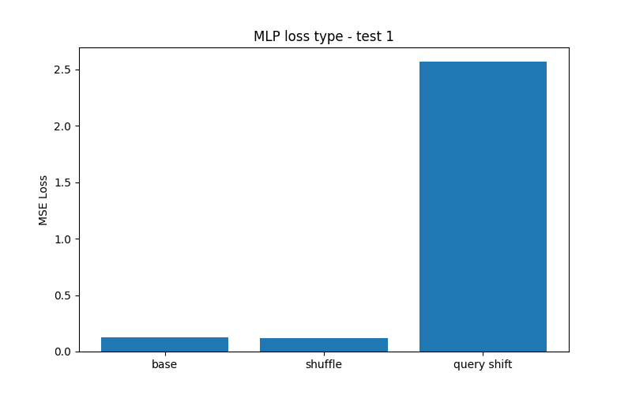

# In-Context Learning: MLP vs Transformer

This experiment showed In-Context Linear Regression using two architectures:
- simple MLP
- Transformer

This will try to make you understand how in-context learning emerges, and how the underlying mechanism differs between MLPs and Transformers

I used a single hidden layer MLP with fixed positional inputs and a token wise, self attention only based transformer for the experiment

## Results

### Loss Comparison

- MLP (base setting)
  MSE Loss: **0.1295**

- Transformer* 
  MSE Loss: **0.0007**

The Transformer achieves significantly lower error, despite both models being trained on the same task distribution

## MLP Stress Tests

### Test 1 — Prompt Perturbation

The MLP was evaluated under three input formats:
- base (training format)
- shuffled context
- query-shifted input

The MLP performs well under base and shuffle settings but fails badly under query shift, indicating strong dependence on absolute input positions

### Test 2 — Neuron Weight Analysis

First-layer weights of the trained MLP were visualized to analyze neuron input relationship

Neurons specialize in fixed input slots, confirming that the MLP encodes prompt structure directly in its weights rather than performing dynamic inference

## Summary

MLPs can exhibit limited in-context learning, but in a brittle, position-dependent manner whereas Transformers implement a stronger form of in-context learning, enabled by attention-based interaction between context tokens

## Refrence

This research was done on the paper "MLPS LEARN IN-CONTEXT ON REGRESSION AND CLASSIFICATION TASKS" by William L. Tong and Cengiz Pehlevan. This is just a small part done for myself to check how they work, You can go ahead and read the full paper as it is published as a conference paper at ICLR 2025
